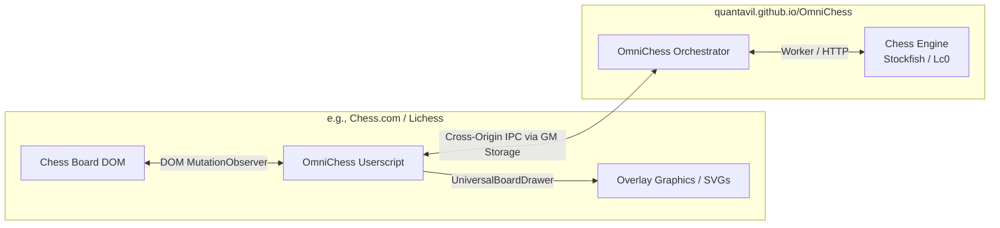

# OmniChess

> [!WARNING]
> OmniChess is currently in development. Expect bugs, especially on variant games.

> [!NOTE]
> The OmniChess userscript source code and build instructions are located in the [userscript/](file:///home/quantavil/Documents/Project/OmniChess/userscript) directory of this repository. This project is a modularized, optimized, and heavily enhanced fork of the original [OmniChess system by HKR/Psyyke](https://greasyfork.org/en/scripts/459137-1-chess-assistant-a-c-a-s-advanced-chess-assistance-system).

OmniChess is an open-source, multi-engine, multi-variant chess assistance system. It provides real-time strategic overlays (threat heatmaps, move markers, multiple suggestions) directly on chess platforms via a userscript communicating with a separate web-based GUI. 

Because calculations run in a separate tab, the target website cannot detect or block the chess engine.

---

## 🌟 Key Features

* **WASM Chess Engines:** Run high-performance WebAssembly engines (Stockfish 17/18, Fairy Stockfish, Lc0, Maia) directly in your browser.
* **Native Engine Support:** Connect to local UCI engines on your desktop via an installable localhost server (`appServer`).
* **Sleek, Unobtrusive Interface:** Seamless visual overlays rendered directly on supported board elements, or stay hidden using Ghost Mode.
* **Humanized Automation:** Human-like move playback featuring quadratic Bezier drag paths, randomized click delays (40ms–110ms), and custom speed profiles.
* **Adaptive Search Depth:** Dynamically scales thinking depth based on active board evaluation (deeper calculations during complex turns, faster responses for clear wins).
* **Multi-Variant Capabilities:** Full support for standard chess, Chess960, and Fairy variants (Crazyhouse, Horde, Atomic) with drop move overlay rendering.
* **Picture-in-Picture Calculations:** Stream calculation overlays inline or using browser Picture-in-Picture windows.
* **No Local Downloads Required:** Run the entire system within your web browser.

---

## 🚀 How It Works

OmniChess uses a distributed, client-backend architecture split into the **Userscript Client** and the **Engine GUI**.



1. **OmniChess Userscript:** Scrapes the chessboard DOM using site-specific adapters, calculates the FEN, and triggers overlays using the UniversalBoardDrawer.
2. **Engine GUI:** Operates in an isolated tab, calculating suggestions without impacting performance or triggering anti-cheat hooks on the chess site.
3. **CommLink Bridge:** Exchanges coordinate lists, evaluations, and configuration data securely via cross-origin Greasemonkey storage APIs.

---

## 🛠️ Installation and Setup

1. **Install a Userscript Manager:**
   Add [Violentmonkey](https://violentmonkey.github.io/) or [Tampermonkey](https://www.tampermonkey.net/) to your web browser.
   * *Note:* If using Tampermonkey v5.3+ on Chromium, you must enable Developer Mode in your browser settings.
2. **Install the Userscript:**
   Install the userscript from [GreasyFork](https://greasyfork.org/en/scripts/583158).
3. **Launch the Engine GUI:**
   Open the hosted [OmniChess GUI](https://quantavil.github.io/OmniChess/app/) in your browser.
4. **Start Playing:**
   Navigate to any supported chess platform (Chess.com, Lichess, PlayStrategy, PyChess, GameKnot, etc.) in a separate browser window, and start playing!

---

## 📂 Repository Structure

* **`app/`**: The core OmniChess GUI frontend application dashboard.
* **`appServer/`**: Desktop integration server (Node.js/Electron) for connecting native UCI engines.
* **`userscript/`**: The frontend client code, built using Bun.
* **`assets/`**: Static visuals, CSS styling tokens, and local WebAssembly engine binaries.
* **`development/`**, **`troubleshoot/`**, **`faq/`**: Guides, documentation pages, and troubleshooting assets.

---

## 📦 Developer Guides

### Building the Userscript
Prerequisites: Make sure you have [Bun](https://bun.sh/) installed.
```bash
cd userscript
bun install
bun run build
```
This outputs the compiled single-file userscript to `userscript/dist/main.js`.

### Running Tests
Verify coordinate mapping calculations:
```bash
cd userscript
bun test
```

---

## ⚙️ Used Libraries

<details>
<summary>View Core Open Source Dependencies ❤️</summary>

| Library | Description | License |
|--------|------------|---------|
| [Fairy Stockfish WASM](https://github.com/fairy-stockfish/fairy-stockfish.wasm) | Chess engine (variants) | GPL-3.0 |
| [Stockfish WASM](https://github.com/nmrugg/stockfish.js/) | Chess engine (main engine) | GPL-3.0 |
| [ZeroFish](https://github.com/schlawg/zerofish) | WASM port of Lc0 + Stockfish | GPL-3.0 |
| [Maia-Chess](https://github.com/CSSLab/maia-chess) | Human-like NN weights | GPL-3.0 |
| [Lozza](https://github.com/op12no2/lozza) | Additional chess engine | MIT |
| [COI-Serviceworker](https://github.com/gzuidhof/coi-serviceworker) | Enables WASM on GitHub Pages | MIT |
| [ChessgroundX](https://github.com/gbtami/chessgroundx) | Chessboard UI (modified) | GPL-3.0 |
| [FileSaver](http://purl.eligrey.com/github/FileSaver.js) | Save config files | MIT |
| [chess.js](https://github.com/jhlywa/chess.js) | Game logic | BSD-2-Clause |
| [onnxruntime-web](https://github.com/Microsoft/onnxruntime) | Run ML models in browser | MIT |
| [Klaro!](https://github.com/klaro-org/klaro-js) | Cookie consent manager | BSD 3-Clause |
| [SnapDOM](https://github.com/zumerlab/snapdom) | DOM → image screenshots | MIT |
| [UniversalBoardDrawer](https://github.com/Hakorr/UniversalBoardDrawer) | Draw arrows on boards | GPL-3.0 |
| [CommLink](https://github.com/AugmentedWeb/CommLink) | Cross-window communication | GPL-3.0 |
| [Bootstrap Icons](https://getbootstrap.com/) | Icon set (loaded locally/offline) | MIT |
| [Mona Sans](https://github.com/github/mona-sans) | Font (GitHub) | SIL Open Font License |
| [Rubik](https://fonts.google.com/specimen/Rubik) | Sans-serif font | SIL Open Font License |
| [IBM Plex Sans](https://github.com/IBM/plex) | IBM typeface | SIL Open Font License |
| [ws](https://github.com/websockets/ws) | WebSocket server library | MIT |
| [Electron](https://www.electronjs.org/) | Desktop app framework | MIT |

</details>

---

For bugs, feedback, or support, please open an issue in this repository.
